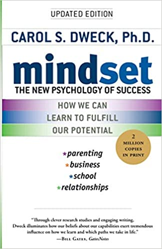
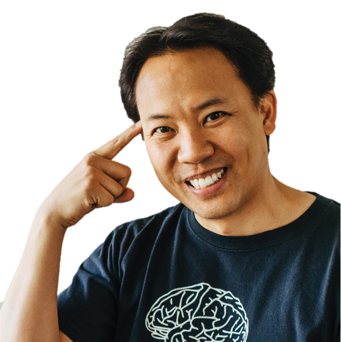

```{r setup, include=FALSE}
options(htmltools.dir.version = FALSE)
knitr::opts_chunk$set(collapse = TRUE,
                      fig.retina = 3)

library(ymlthis)
library(tidyverse)
library(xaringanExtra)
library(palmerpenguins)
xaringanExtra::use_panelset()
xaringanExtra::use_share_again()
xaringanExtra::style_share_again(
  share_buttons = c("twitter", "linkedin", "pocket")
)
```

```{r broadcast, echo=FALSE}
xaringanExtra::use_broadcast()
```

class: title-slide, center, bottom

# `r rmarkdown::metadata$title`

## `r rmarkdown::metadata$subtitle`

### `r rmarkdown::metadata$author`

???

Welcome to the seminar on learning how to learn

Where I will show you how to effectively learn. .

---
layout: true

<a class="footer-link" href="https://jigme-tenzin.netlify.app/talks">learn/tips</a>

---
name: cnr
class: center, middle
background-image: url(images/cnr-snow-2022.jpeg)
background-size: cover

```{css, echo=FALSE}
.panelset {
  --panel-tab-font-family: Work Sans;
  --panel-tab-background-color-active: #fffbe0;
  --panel-tab-border-color-active: #023d4d;
}

.panelset .panel-tabs .panel-tab > a {
	color: #023d4d;
}
```

---
template: cnr

## .big-text[Hello.]

???

So hello- I'm so happy to meet you guys and give this talk on how to learn. Learning is prerequisite for a school. However, as a students, one is rarely taught how to learn effectively. 

---
name: clouds
background-image: url(images/clouds.jpg)
background-size: cover

---
name: hello
template: clouds
class: middle, center


### Jigme Tenzin


[`r icons::fontawesome("github")` @jigme77](https://github.com/jigme77)  
[`r icons::fontawesome("twitter")` @tenz_jigme](https://twitter.com/tenz_jigme)  
[`r icons::fontawesome("link")` jigme-tenzin.netlify.app](https://jigme-tenzin.netlify.app)


???
My name is Jigme Tenzin. I work as lecturer in the department of animal science. Now, I am a trainee at Rural Development Administration, South Korea.


---
class: freight-slide, center, middle, inverse

# .shadow-text[I love learning.]

???
I feel it is prerequisite for everyone to love learning. In the 21st century, information is available everywhere.But as a student, it has been hard climb. We are bombarded with constant distraction. 
I try learning new things. I can programme a bit in R and beginner in python programming. I I try to read a lot now.

---
template: clouds
class: middle, center

## Who are you?

---
class: middle, center

<div class="flex" style="margin: 0 1em;">
  <div class="column">
    <h3> You're a student <h3>
    
  </div>
  
???


Here's who I know you are...

You're an student. You want to learn. You want to do good in life. Probably, learning has been not easy for you.
  
--

   <div class="column"style="margin: 0 1em;">
    <h3> You have many things to learn and master  </h3>
    
  </div>
  

???

You have many materials or subjects or modules to read ...


---
class: middle, center


<div class="flex" style="margin: 0 1em;">
  <div class="column">
    <h3> You are a student </h3>
    
  </div>
  
  <div class="column"style="margin: 0 1em;">
    <h3> You have many things to learn and master </h3>
    
  </div>
  

--
  <div class="column" style="margin: 0 1em;">
    <h3> You work really hard </h3>
    
  </div>
</div>

???

Maybe sometimes too hard.

---
class: center
background-image: url("images/subjects.jpg")
background-size: contain
background-color: #f6f6f6

---
class: center
background-image: url("images/lesson-time.jpg")
background-size: contain
background-color: #f6f6f6

## How it feels

???

As a learner you have many things to study: History, Science, Math, Biology, Chemistry, and Phyiscs


---
class: center

# How do you learn to ride a bicycle

--
## Step 1: Climb onto it

--
## Step 2: Trying to paddle ...

--
## Step 3: Falls down ...

--
## Step 4: Falls down ...

---
class: center

# How do you learn to ride a bicycle

--

## Step 5 - 100: Falls down ...

--
> # Learning should be like learning to ride a bicycle. You don't give up until you ride them.

???
Learning should be like riding a bicycle and treated like it. If you think carefully, the analogy is same. You will not leave learning the bike half-baked because it is life and death situation. However, in learning - we tend not to understand the concepts really well.

---
class: top, center

# The joy of riding a bike


---
class: left, top

--
# So how do we really learn


> ## Your mindset is the bedrock for learning

--
.pull-left[ 
- ### I cannot grow
- ### I am not intelligent
--------------------
--
## Fixed Mindset
]
--
.pull-right[
- ### I can grow
- ### I can work hard
-------------------
--
## Growth Mindset
]


???
before really going into it lets talk about our mindsets. Sometimes we feel that we are not cut out for something. I am not at this, I am not good at this. What you need to do is cultivate a growth mindset. Shift your perspective from fixed mindset to growth mindset. Say I can grow.

---
class: center, middle



# [Mindset by Carol Dweck](https://www.amazon.com/Mindset-Psychology-Carol-S-Dweck/dp/0345472322)


---
class: inverse, center, middle

--
# How to Learn

--
## 1. UNDERSTANDING 

--
## 2. REMEMBERING

--
## 3. FOCUSING


---
class: middle, center

# UNDERSTANDING

???

Understanding a concept is the first prerequisite to learning. If you do not understand, there is no point in remembering. 


---
class: top, left

# Understanding


---
class: top, center

# Richard Feynman

.left-column[
> ## The best teacher I never had.” 
### ~ Bill Gates
					
					]

.right-column[

]


---
--
# Feynman technique

--
### Teaching it to someone

--
> #### If you cannot explain it simply, you haven't understood


--
## How to go about it?

--
- ### Keep the language as simple as possible. Try translating it to your native tongue.

- ### Drill down to the essence

???
In general, keep the language simple. Try explaining it in own language.

Drill down to the essence. How can I explain it in simple words, as simple as possible. For example, what is a research hypothesis? It is a claim that you are making.

---

# Question to ask as you learn some new concepts? 

## - Does this make sense? Could I explain this to a 5 year old?

## - Explain it to your friends. Ask why? Try explaining, if you cannot explain, then go back and study the concept, fill the gap. 

---

.left-column[
> ##  “When I teach, I get to learn it twice.” 
### ~ Jim Kwik, Author of Limitless and Brain Coach

]

.right-colum[

]

---

.left-column[


]

.right-column[

> ## “It is not about mental intelligence; it is about mental fitness.” 
~ Jim Kwik, Author and Coach

> ## "Teaching is a great way to keep learning."
~ Matthea Harvey - an American poet
]

---

# The Science of Active Recall

> ### Retrieving information memory through, essentially, testing yourself at every stage of the revision process.

## Evidence

--
- The first group would read the material only once.

--
- The second group would read the material four times.

--
- The third group would read the material then were told to make a mind map.

--
- The fourth group would red the material once, then recall as much as possible.

--
> Karpicke, J. D., & Blunt, J. R. (2011). Retrieval practice produces more learning than elaborative studying with concept mapping. Science, 331(6018), 772-775.

---
# Strategy

--
### - Think about what you have learned

--
### - Test on the concept

--
### - Practice Retrieval

--
### - Trust the process

> #### “Test ourselves as a way to learn new concepts.”


> #### Improving students’ learning with effective learning techniques: promising direction from cognitive and educational psychology. ~ Dunlosky et al. (2013)
						
---
class: left

# Strategy

.pull-left[
## - Closed the book - and write notes

## - Alternative to making notes - ask questions 

## - Use Anki flashcards
]

.pull-right[

]

---
class: center
.pull-left[]


> ### One of the most striking research findings is the power of active retrieval—testing—to strengthen memory, and that the more effortful the retrieval, the stronger the benefit."
~ Peter C. Brown

> ### One of the best habits a learner can instill in herself is regular self-quizzing to recalibrate her understanding of what she does and does not know.
~ Peter C. Brown


---

# Taking notes during class
----

## - Handwritten notes are better (University of Washington Research)

## - Harder you have to work for something, better the results

## - Use mindmap to write notes

> ### "Notetaking during class also drives away sleep."

---

# Taking notes after class

## - Build active recall questions

> ### "Consolidate understanding with active recall."


---


---
# Scoping the subject?

> ### "Where does the subject fits in whole?"

## - Don't lose the forest for the trees.

## - Look at the syllabus or the module descriptor. 

## - Get the gist of the subject as a whole.

---
# Why do you need to understand?

- **First step towards real learning**

- **If you understand, it is easier to retain**

- **How do you know that you have understood?**
    - Internal coherence
    - Gold standard is to explain it to 5 year olds 
- **Have a mental model of the subject or concepts**
- **Create your own syllabus if you are stuck (find your own resouces)**

> ### You can't know everything, but you have to know some things really well.


---
class: middle, center

# Remembering


---
class: middle, center
# Thank you!

All art by [Allison Horst](https://www.allisonhorst.com/) & [Desirée De Leon](https://desiree.rbind.io/). Beautiful pictures from [unsplash](https://unsplash.com)

### Find me at...

[`r icons::fontawesome("twitter")` @tenz_jigme](http://twitter.com/tenz_jigme)  
[`r icons::fontawesome("github")` @jigme77](http://github.com/jigme77)  
[`r icons::fontawesome("link")` jigme-tenzin.netlify.app](https://jigme-tenzin.netlify.app)  
[`r icons::fontawesome("paper-plane")` jtenzin.cnr@rub.edub.bt](mailto:jtenzin.cnr@rub.edu.bt)
