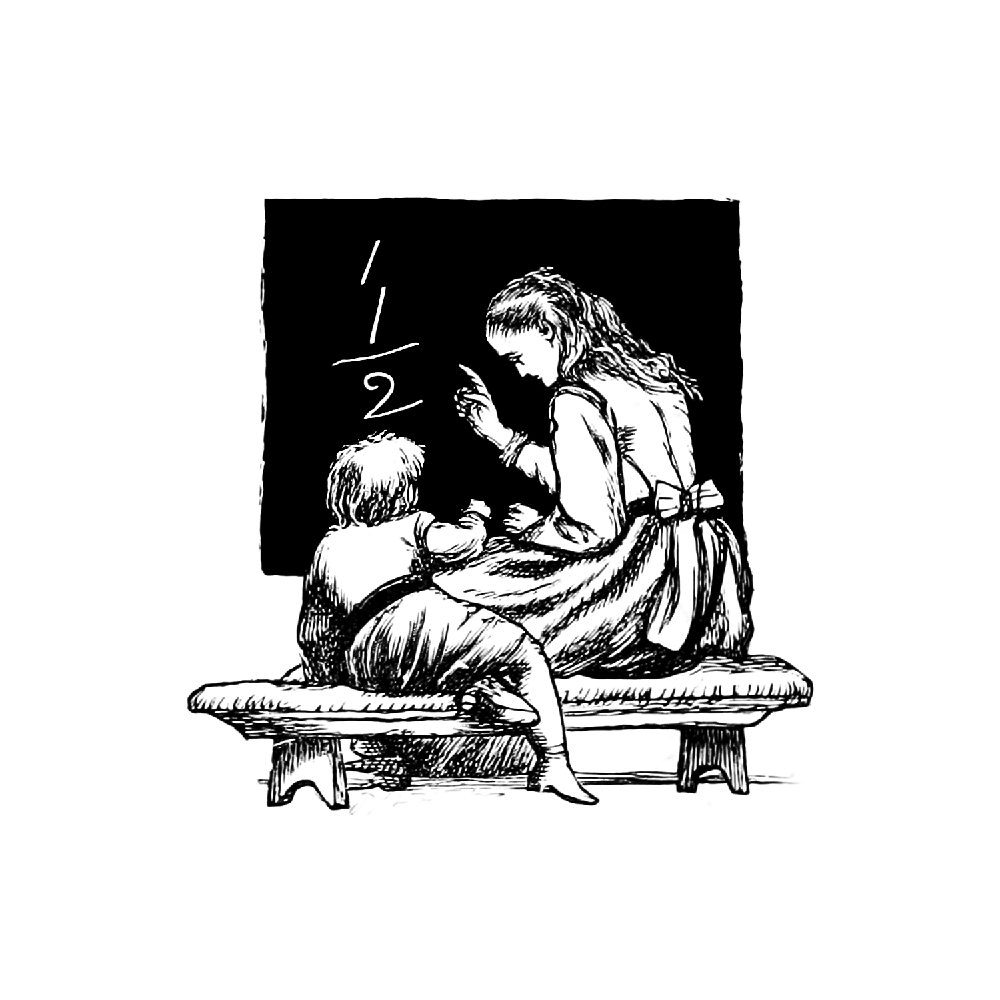
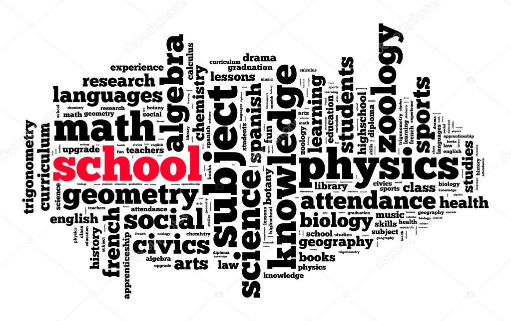
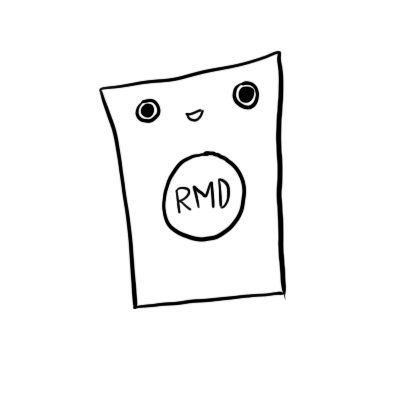
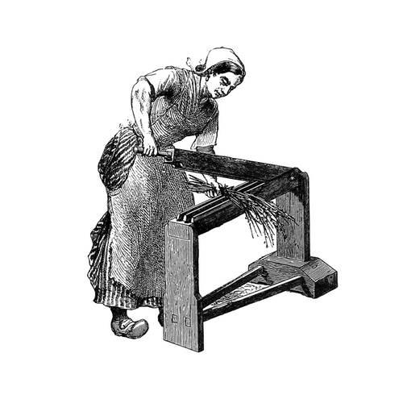

```{r setup, include=FALSE}
options(htmltools.dir.version = FALSE)
knitr::opts_chunk$set(collapse = TRUE,
                      fig.retina = 3)

library(ymlthis)
library(tidyverse)
library(xaringanExtra)
library(palmerpenguins)
xaringanExtra::use_panelset()
xaringanExtra::use_share_again()
xaringanExtra::style_share_again(
  share_buttons = c("twitter", "linkedin", "pocket")
)
```

```{r broadcast, echo=FALSE}
xaringanExtra::use_broadcast()
```

class: title-slide, center, bottom

# `r rmarkdown::metadata$title`

## `r rmarkdown::metadata$subtitle`

### `r rmarkdown::metadata$author`

???

Welcome to the seminar on learning how to learn

Where I will show you how to effectively learn. .

---
layout: true

<a class="footer-link" href="https://jigme-tenzin.netlify.app/talks">learn/tips</a>

---
name: cnr
class: center, middle
background-image: url(images/cnr-snow-2022.jpeg)
background-size: cover

```{css, echo=FALSE}
.panelset {
  --panel-tab-font-family: Work Sans;
  --panel-tab-background-color-active: #fffbe0;
  --panel-tab-border-color-active: #023d4d;
}

.panelset .panel-tabs .panel-tab > a {
	color: #023d4d;
}
```

---
template: cnr

## .big-text[Hello.]

???

So hello- I'm so happy to meet you guys and give this talk on how to learn. Learning is prerequisite for a school. However, as a students, one is rarely taught how to learn effectively. 

---
name: clouds
background-image: url(images/clouds.jpg)
background-size: cover

---
name: hello
template: clouds
class: middle, center


### Jigme Tenzin


[`r icons::fontawesome("github")` @jigme77](https://github.com/jigme77)  
[`r icons::fontawesome("twitter")` @tenz_jigme](https://twitter.com/tenz_jigme)  
[`r icons::fontawesome("link")` jigme-tenzin.netlify.app](https://jigme-tenzin.netlify.app)


???
My name is Jigme Tenzin. I work as lecturer in the department of animal science. Now, I am a trainee at Rural Development Administration, South Korea.


---
class: freight-slide, center, middle, inverse

# .shadow-text[I love learning.]

???
I feel it is prerequisite for everyone to love learning. In the 21st century, information is available everywhere.But as a student, it has been hard climb. We are bombarded with constant distraction. 
I try learning new things. I can programme a bit in R and beginner in python programming. I I try to read a lot now.

---
template: clouds
class: middle, center

## Who are you?

---
class: middle, center

<div class="flex" style="margin: 0 1em;">
  <div class="column">
    <h3> You're a student <h3>
    
  </div>
  
???


Here's who I know you are...

You're an student. You want to learn. You want to do good in life. Probably, learning has been not easy for you.
  
--

   <div class="column"style="margin: 0 1em;">
    <h3> You have many things to learn and master  </h3>
    
  </div>
  

???

You have many materials or subjects or modules to read ...


---
class: middle, center


<div class="flex" style="margin: 0 1em;">
  <div class="column">
    <h3> You are a student </h3>
    
  </div>
  
  <div class="column"style="margin: 0 1em;">
    <h3> You have many things to learn and master </h3>
    
  </div>
  

--
  <div class="column" style="margin: 0 1em;">
    <h3> You work really hard </h3>
    
  </div>
</div>

???

Maybe sometimes too hard.

---
class: center
background-image: url("images/subjects.jpg")
background-size: contain
background-color: #f6f6f6

---
class: center
background-image: url("images/lesson-time.jpg")
background-size: contain
background-color: #f6f6f6

## How it feels

???

As a learner you have many things to study: History, Science, Math, Biology, Chemistry, and Phyiscs


---
class: center

# How do you learn to ride a bicycle

--
## Step 1: Climb onto it

--
## Step 2: Trying to paddle ...

--
## Step 3: Falls down ...

--
## Step 4: Falls down ...

---
class: center

# How do you learn to ride a bicycle

--

## Step 5 - 100: Falls down ...

--
> # Learning should be like learning to ride a bicycle. You don't give until you ride them.

---

---
background-image: url("images/cycle.jpg")
background-size: contain
background-color: #f6f6f6

---
class: center, middle

# Thank you!

All art by [Allison Horst](https://www.allisonhorst.com/) & [Desirée De Leon](https://desiree.rbind.io/). Beautiful pictures from [unsplash](https://unsplash.com)

### Find me at...

[`r icons::fontawesome("twitter")` @tenz_jigme](http://twitter.com/tenz_jigme)  
[`r icons::fontawesome("github")` @jigme77](http://github.com/jigme77)  
[`r icons::fontawesome("link")` jigme-tenzin.netlify.app](https://jigme-tenzin.netlify.app)  
[`r icons::fontawesome("paper-plane")` jtenzin.cnr@rub.edub.bt](mailto:jtenzin.cnr@rub.edu.bt)
